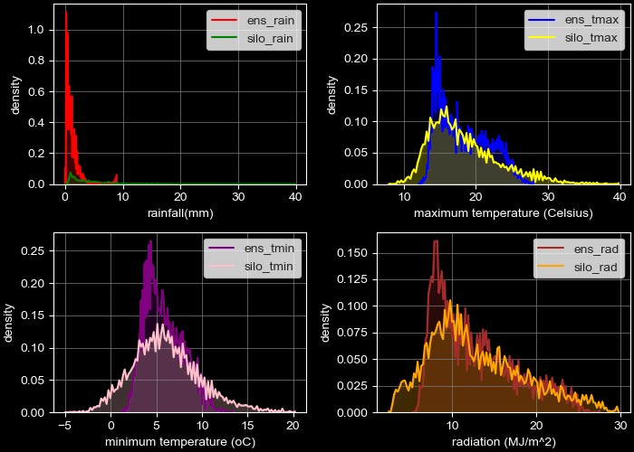

```{r setup, include=FALSE}
knitr::opts_chunk$set(
  results = 'asis',
  echo = FALSE,
  warning = FALSE,
  message = FALSE,
  fig.align = 'centre'
)

#Load libraries
library(tidyverse)
library(gapminder)
library(gganimate)
library(kableExtra)
library(knitr)
library(jpeg)
library(png)
library(reticulate)
```


# Introduction 
I started Data School as an Administration Officer for Program 8 with no real experience in data management but had dabbled ever so slightly in coding. As of the first of July our program merged with Program 7. The new program is called Landscapes and Global Change and I have a new role which will ensure best practice data archiving and management systems for our program. I will also be embedded into projects to provide project, data and analytic support. :)

# My Synthesis Project
This project will produce visualisations of statistical comparisons between\s\s 

  * weather observation data provided by the State of Queensland (SILO database) SILO 

  * weather forecast data from the Bureau of Meteorology (ACCESS-S forecast model) 

Only one location will be used (Birchip, Victoria, latitude=-35.99 & longitude=142.92)

AgScores will produce results to inform climate scientists of the efficacy of climate predictions, from the point of view of Agricultural productivity (wheat yield potential). This work enables climate scientists to debug their climate models when their predicted wheat yield potential does not match the predicted wheat yield potential of APSIM + SILO.

# My Digital Toolbox

I have used R, Python, Anaconda, Jupyter, xarray, requests, io, pandas, datetime, numpy, Matplotlib, from mpl_toolkits.mplot3d import Axes3D, Seaborn, scipy.stats, regex

## Favourite tool

I have a couple of favourite tools. 

{width=100px style="float: left; margin: 2%"} allows you to pull out the exact subset of data that you need.
  
The second is matplotlib which allows you to make lovely visualisations from your data. {width=200px style="float: left; margin: 2%"}

# My time went ...

by manipulating data to get it into shape. And then reshaping it to get it right again. I had help with the correct commands to pull the data out of the databases and then I was responsible for doing the manipulations.

...and making plot after plot after plot. Most of these didn't really see the light of day but some are here on the poster and will help help to make the AgScores tool easier to use and interpret.

{width=200px style="float: right; margin: 2%"} 
Embarrassingly, I spent a lot of time trying to work out paths to where my work was stored and working out protocols that I really should remember. 

# Next steps

I need to plot more metrics that are useful and will tell a story. It would be good to develop a GUI to make the tool even easier to use. R Shiny is a good tool for this but the code needs to be in python. There are a few platforms to choose from - PYQT5, Tkinter, WxPython, Kivy and PyForms. Tkinter seems to be the most popular. 

# Tables
```{python results = "hide"}
# no results will be displayed in the knitted document from this chunk
import xarray as xr

# xarray opens the netcdf file
nc = xr.open_dataset("ensemble_siloaccess_s.nc")

# Get some properties (attributes) from the netcdf file
# Attributes are values that the creator of the file has provided as a sort of header
# I will need the lon and lat later to call exactly the right silo data
start_month = nc.attrs["hindcast_start_month"]
lon = nc.attrs["longitude"]
lat = nc.attrs["latitude"]

# Get time bounds properties of the .nc file, which aren't declared attributes
minyear = int(min(nc.year))
maxyear = int(max(nc.year))

import pandas as pd
# Now we convert the imported netcdf object to a pandas dataframe
ensemble_df = nc.to_dataframe().reset_index()

# now we need to convert all variables to the types that are going to be useful for us to use
ensemble_df["ens"] = ensemble_df["ens"].astype(int)
ensemble_df["ensday"] = ensemble_df["ensday"].astype(int)
ensemble_df["year"] = ensemble_df["year"].astype(int)
ensemble_df["rad"] = round(ensemble_df["rad"].astype(float),1)
ensemble_df["tmax"] = round(ensemble_df["tmax"].astype(float),1)
ensemble_df["rain"] = round(ensemble_df["rain"].astype(float),1)
ensemble_df["tmin"] = round(ensemble_df["tmin"].astype(float),1)

#convert the ens column to a string and then convert to two characters
ensemble_df["ens"] = ensemble_df["ens"].astype(str).str.pad(width=2, side='left', fillchar='0')

#convert the ensday column to a string and then convert to three characters
ensemble_df["ensday"] = ensemble_df["ensday"].astype(str).str.pad(width=3, side='left', fillchar='0')

# combine the year and the ensemble day into a variable
# this gives us a single identifier for each row of data
# we will use this to join with the silo data
ensemble_df['year_ensday'] = ensemble_df['year'].astype(str) + ensemble_df['ensday']

# find the mean of each ensemble variable for each day
# we will only be working with the mean, not each individual ensemble
ensemble_df_mean = ensemble_df.groupby(["year_ensday"]).mean()

# rename all variables to reflect they are from access-s ensemble data
# convert all variables to the types that are going to be useful for us to use
# restrict the number to one decimal number
ensemble_df_mean["ens_rad"] = round(ensemble_df_mean["rad"].astype(float),1)
ensemble_df_mean["ens_tmax"] = round(ensemble_df_mean["tmax"].astype(float),1)
ensemble_df_mean["ens_rain"] = round(ensemble_df_mean["rain"].astype(float),1)
ensemble_df_mean["ens_tmin"] = round(ensemble_df_mean["tmin"].astype(float),1)

# drop the columns that won't be used in the analysis
ensemble_df_mean = ensemble_df_mean.drop(columns="year")
ensemble_df_mean = ensemble_df_mean.drop(columns="rad")
ensemble_df_mean = ensemble_df_mean.drop(columns="tmax")
ensemble_df_mean = ensemble_df_mean.drop(columns="rain")
ensemble_df_mean = ensemble_df_mean.drop(columns="tmin")

# Get SILO data to compare ensemble with it
# this is using the lat and lon we extracted from the attributes in the ensemble data
# Set SILO url download link (specifying csv format)
silourl = "https://dcdp.research.csiro.au/silogrid?lat="+ str(lat)  +"&lon=" + str(lon) +" &format=csv&start=" + str(minyear) +"0101&stop=" + str(maxyear) +"1231"

import requests
# Download SILO data
# the response needs to be 200 - 500 is an error
httpreq = requests.get(silourl, verify=False)

import io
# Use the StringIO function to interpret the csv-like object as if it was saved to disk, then read_csv into pandas
# In computing, input/output or I/O (or, informally, io or IO) is the communication between an information processing system, 
# such as a computer, and the outside world, possibly a human or another information processing system.
silo_df = pd.read_csv(io.StringIO(httpreq.content.decode('utf-8')))

# This is to remove the second header row. 
# The first header row contains the names 
# and the second contains the units, which we don't need for our tables. 
silo_df = silo_df.iloc[1:]

# Set columns to correct format
silo_df["date"] = silo_df["date"].astype(str)

# import the regex library which is called re
import re

# the ensemble_df has days from April 1st to November 2nd (!!???) each year - a total of 216 days.
# to be able to compare the two data frames it is necessary to crop the silo_df so that it has the same days
# we use regex to do this
silo216_df = silo_df[silo_df['date'].str.contains(r'....-04-..|....-05-..|....-06-..|....-07-..|....-08-..|....-09-..|....-10-..|....-11-01|....-11-02')]

import datetime
# first convert date string to datetime with a proper format string
df = pd.DataFrame({'Date':pd.to_datetime(silo216_df['date'], format='%Y-%m-%d')})

# calculate day of year
# subtract 91 to start at the 1st of April
silo216_df['DOY'] = df['Date'].dt.dayofyear - 91

# split the date column into year, month and day
# use the hyphen as the split 
silo216_df = silo216_df.join(silo216_df['date'].str.split('-', 2, expand=True).rename(columns={0:'year', 1:'month', 2:'day'}))

# this makes the day of the year into a three character string
silo216_df["DOY"] = silo216_df["DOY"].astype(str).str.pad(width=3, side='left', fillchar='0')

# join the year and DOY columns
silo216_df['year_ensday'] = silo216_df['year'].astype(str) + silo216_df['DOY']

# rename all variables to reflect they are from silo data
# round the variables to one decimal point
silo216_df["silo_rad"] = round(silo216_df["rad"].astype(float),1)
silo216_df["silo_tmax"] = round(silo216_df["tmax"].astype(float),1)
silo216_df["silo_rain"] = round(silo216_df["rain"].astype(float),1)
silo216_df["silo_tmin"] = round(silo216_df["tmin"].astype(float),1)

# get rid of the columns that we don't need to use
silo216_df = silo216_df.drop(columns="rad")
silo216_df = silo216_df.drop(columns="tmax")
silo216_df = silo216_df.drop(columns="tmin")
silo216_df = silo216_df.drop(columns="rain")
silo216_df = silo216_df.drop(columns="date")
silo216_df = silo216_df.drop(columns="month")
silo216_df = silo216_df.drop(columns="day")
silo216_df = silo216_df.drop(columns="year")
silo216_df = silo216_df.drop(columns="DOY")
silo216_df = silo216_df.drop(columns="vp")

#join the two dataframes together to perform analyses
fcast_vs_obs = pd.merge(ensemble_df_mean, silo216_df, on ='year_ensday')

# remove the index column and use the year_ens as the index column instead
fcast_vs_obs.set_index('year_ensday', inplace=True)
```

```{r}
#USE r TO DISPLAY THE TABLE - kableExtra
#knitr::kable(table.attr = "style='width:30%;'")
knitr::kable(head(py$fcast_vs_obs), table.attr = "style='width:20%;'") %>% 
  kable_styling( 
    bootstrap_options = c("striped")
    )
```
### Table 1. Combined ENSEMBLE and SILO data dataframe (header only)

# Plots
```{python pyplot, echo=FALSE, results = "hide"}
import os
import matplotlib
import numpy as np
import matplotlib.pyplot as plt
import seaborn as sns

#construct a figure with a dark background
plt.style.use('dark_background')

#assign each of the columns in the array to a variable
sRain = fcast_vs_obs["silo_rain"]
eRain = fcast_vs_obs["ens_rain"]
sTMa = fcast_vs_obs["silo_tmax"]
eTMa = fcast_vs_obs["ens_tmax"]
sTMi = fcast_vs_obs["silo_tmin"]
eTMi = fcast_vs_obs["ens_tmin"]
sRad = fcast_vs_obs["silo_rad"]
eRad = fcast_vs_obs["ens_rad"]

# construct a figure with 2 rows of 2 subplots
# the layout will stop overlap of the subplots
fig, ax = plt.subplots(2,2, constrained_layout = True)

# each subplot will be a kdeplot comparing the silo and the ensemble version
# of the same variable
# thr gridlines will be gray and thin
# the legends will be white
sns.set_style('white') 
ax1 = sns.kdeplot(eRain, bw=0, color = 'red', shade = 'true', ax=ax[0,0])
ax1 = sns.kdeplot(sRain, bw=0, color = 'green', shade = 'true', ax=ax[0,0])
ax1.set(xlabel = 'rainfall(mm)', ylabel = 'density')
ax1.grid(color='gray', linewidth=0.5)

sns.set_style('white')
ax2 = sns.kdeplot(eTMa, bw=0, color = 'blue', shade = 'true', ax=ax[0,1])
ax2 = sns.kdeplot(sTMa, bw=0, color = 'yellow', shade = 'true', ax=ax[0,1])
ax2.set(xlabel = 'maximum temperature (Celsius)', ylabel = 'density')
ax2.grid(color='gray', linewidth=0.5)

sns.set_style('white')
ax3 = sns.kdeplot(eTMi, bw=0, color = 'purple', shade = 'true', ax=ax[1,0])
ax3 = sns.kdeplot(sTMi, bw=0, color = 'pink', shade = 'true', ax=ax[1,0])
ax3.set(xlabel = 'minimum temperature (oC)', ylabel = 'density')
ax3.grid(color='gray', linewidth=0.5)

sns.set_style('white')
ax4 = sns.kdeplot(eRad, bw=0, color = 'brown', shade = 'true', ax=ax[1,1])
ax4 = sns.kdeplot(sRad, bw=0, color = 'orange', shade = 'true', ax=ax[1,1])
ax4.set(xlabel = 'radiation (MJ/m^2)', ylabel = 'density')
ax4.grid(color='gray', linewidth=0.5)

#plt.show()
plt.savefig('resources/img/kdeplots.png')
``````
### Figure 1. Density Graphs comparing Forecast (ensemble) data with Observed (silo) data
{width=1200px}

# Acknowledgements

Data School Teachers: Loretta Clancy, Daniel Collins, Carmi Cronje, Adrian D'Alessandro, Ondrej Hlinka, Mikaela Lawrence, Kerensa McElroy, Terry Neeman (ANU), Stephen Pearce, Jared Raynes, Fran Samsing, Andrew Spriggs, Chris Watkins, Alex Whan


Mentors: Jared, Ryan Farquharson, Javi Navarro Garcia, Nat Lui


Students: James Broadbent, Rosangela Devilla, Fernanda Dreccer, Shok Jalilov, Emmett Leyne, Tracey May, Gordon McLachlan, Tony Nadelko, Seija Tuomi, Shaun Verrall, Yingying Yu 


My Family: Alex, Christina and Julia xxx


...and of course Michael Battaglia :)

# My Data School Experience

I thought Data School was a fantastic experience. To have the opportunity to spend five months learning something new in a course that was run totally in-house was an unbelievable opportunity. I really enjoyed the comaraderie with the other students and the freedom to study again. The course facilitators were all very knowledgeable and very patient! I enjoyed pretty much all that we covered. (Stats was hard)

I have just started a newly created Program Data Support position for our program which will put many of my newly acquired skills to use. I will be liaising with project leaders at inception to assist them in creating Data and Software Management Plans and again at end of projects to confirm data and records archival. I have received very supportive correspondence from program members who are looking forward to working with me to achieve this.

I will also be continuing this project. I have already attended a three day "SPRINT" in Hobart where those working on the project came together to work on the project at the same time without any interruptions. (Look at me, coding, with L plates and lots of people to hold my hand)


